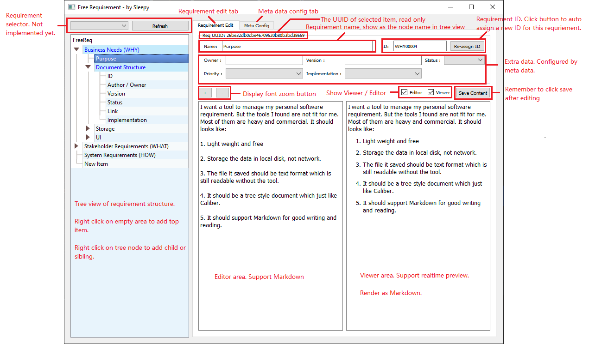
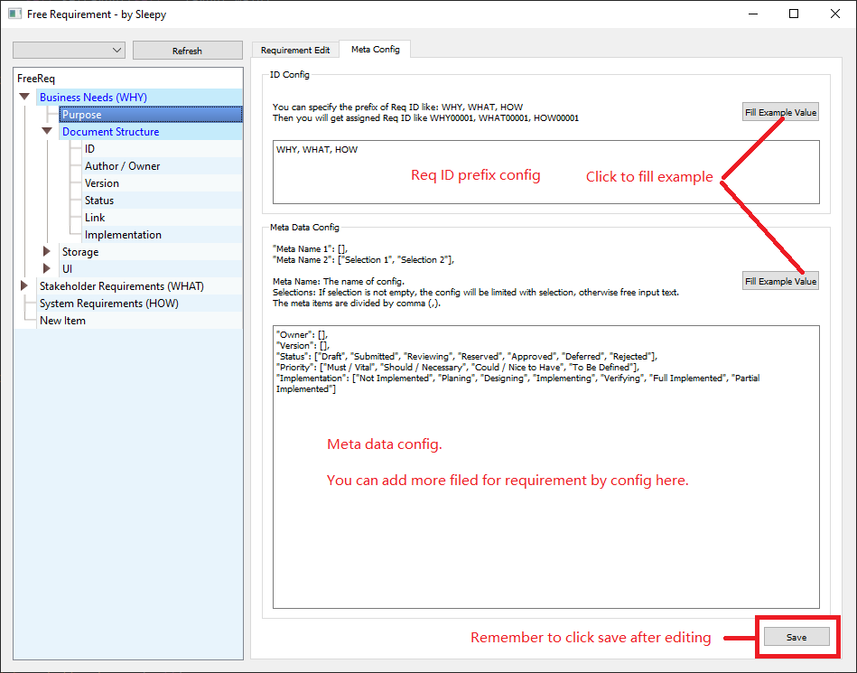
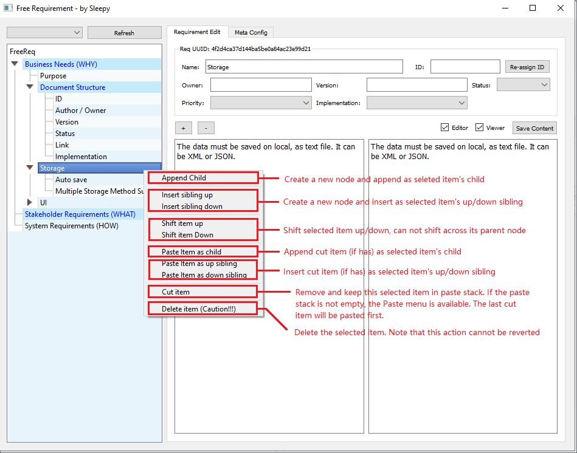

[EN](README_EN.md)

# FreeReq

一个免费的开源需求管理工具。

我需要一个工具来管理个人的开源项目需求，但找不到合适的工具。因为大部分的需求管理工具都是收费的，并且比较重型。我期望的工具是这样的：

1. 免费，轻量级

2. 需求文件必须存储在本地，不能接受在线使用

3. 保存的需求文件必须为文本文件，即使不使用特定工具也能阅读，并且有利于git管理

4. 以树形的结构组织需求文档

5. 它应该支持Markdown编辑

由于找不到这样的工具，所以我决定自己写一个。

# 介绍

FreeReq可以将需求文档组织成树形结构。一个需求文档可以包含子需求文档。 

一个需求文档包含以下基本信息：

+ UUID - 文档唯一标识

+ Req ID - 文档的需求ID

+ Title - 文档标题，做为树的节点名

+ Content - 文档内容，以Markdown格式编辑

+ Last Editor - 最后一个编辑者，程序应自动读取系统用户名

+ Last Updater Time - 最后的编辑时间，程序应自动填入保存时间

此外，用户还可以自定义字段，这些字段统称为Meta Data，这些数据会成为需求文档的一部分。

详细的需求说明可以参考FreeReq.req文件。

# 如何运行

你可以下载打包好的release exe直接运行，优点是方便，缺点是：

+ 体积较大

+ markdown的显示效果不好
> 因为打包成exe后QtWebEngine会丢失，导致HTML渲染效果不好

+ 不支持插件功能

推荐的方式是直接用python运行FreeReq.py，

+ 你可以使用pip install -r requirements.txt安装所有依赖。

+ 或者直接运行“run.bat”来创建虚拟环境并自动安装依赖（推荐）。
> 如果运行不正常，可以删除“env”文件夹并重新运行“run.bat”

# 插件

FreeReq支持插件扩展。你可以将“doc/config_example.json”重命名为“config.json”并将其放在FreeReq根目录中。编辑它以启用更多插件。

当前已实现的插件如下：

## ScratchPaper

有时候我们需要复制粘贴一些固定格式的文本，这个插件就是用来缓存常用文本的。

当该插件使能后，界面上会增加一个“ScratchPaper”按钮，点击该按钮打开草稿纸窗口。
你可以在草稿纸中加入预设的文本，其中的内容会自动保存，下次运行FreeReq时会自动载入。

## ReqHistory

这个插件会在每次保存时将保存前的需求文件备份一份到backup目录，并保持最新的30个历史文件。

这个插件没有操作入口，只要使能便会在后台生效。

## MarkdownStyle

这个插件能让用户自由选择Markdown渲染的风格。

当该插件使能时，界面上会增加一个选择框，里面会列出“plugin/MarkdownStyle”目录下所有的.css文件。
当你选择了一个样式文件后，Markdown预览窗口显示会实时更新为你选择的风格。

你也可以向”plugin/MarkdownStyle“目录加入你喜欢的CSS风格文件。

## ResourceManager

该插件用以方便地清理attachment目录下未被引用的文件，以及检查文档中引用的图片和附件资源是否有效。

这个插件会列出现存的资源文件以及文档中引用的文件，并会检查其状态：

+ OK - 文档中引用的文件有效

+ Invalid - 文档中引用的资源不存在

+ No Reference - 资源文件未被文档引用

该插件还提供一键清理功能，点击后会将attachment目录下状态为“No Reference ”的文件删除。

## EmbeddingIndexing

基于KeyFaiss，使用embedding对需求项进行索引。借助向量数据库，用户可以通过自然语言对需求文档进行搜索。

请注意，embedding模型会影响搜索结果。理论上根据不同的语言，需要在程序中选择对应的embedding模型。

这个插件需要faiss和text2vec库支持。

## ChatReq - 和AI聊需求，最酷炫的功能

基于EmbeddingIndexing插件的搜索结果，使用LLM和用户进行对话。

理论上，有了嵌入搜索结果和正确提示。我们可以使用任何LLM来实现此功能。 LLM越强大，效果越好。

现在支持以下LLM：

+ ChatGLM3

+ 类ChatGPT API的LLM网络服务

并基于gradio提供网页聊天功能。

这个插件需要HuggingFace库支持。

# 更新

## 20230711

+ 添加搜索功能，通过CTRL+F快捷键打开搜索窗口，可以搜索整个树和所有内容（F3 查找下一个，SHIFT + F3 查找上一个）
+ 编辑器可以接受文件拖放。
+ 编辑器支持图像和表格粘贴。
+ 使用 QWebEngineView 进行 markdown 预览（可选），它比 QTextView 更好看。

## 20240117

+ 添加打包脚本（build.py, clean.py）。
+ 已知问题：pyinstaller对QtWebEngine支持不好，因此在exe中无法使用WebView，影响观感。

## 20240227

+ 使用Chat-GLM2，调试和更新ChatReq插件
+ 添加打印树功能。注意此功能依赖于 QWebEngineView。
+ 添加MarkdownStyle插件。

## 20240305

+ 修复拖动资源进入编辑器后的光标问题。

## 20240626

+ 添加 ReqHistory 插件
+ 添加 ResourceManager 插件
+ 添加需求文件更改监视
+ 添加 Req ID 批量分配
+ 改进 ChatReq：添加 ChatLLM.py 和 WebChat.py

# 使用方法

