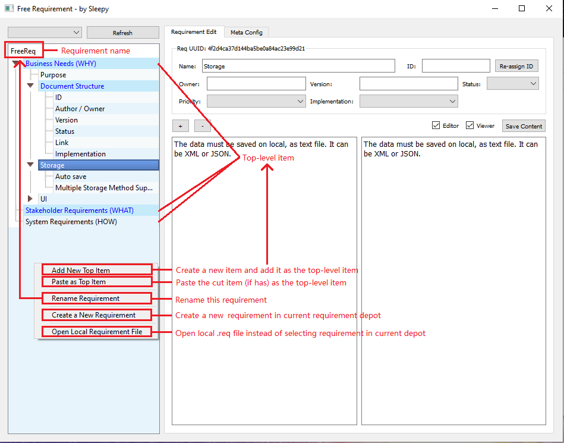

# FreeReq
A free and open source requirement management tool.

I need a light-weight, free, Caliber (a Borland software) like requirement management tool. But I didn't find one. So I wrote such a software.

# Introduce
FreeReq can organize requirement document as tree structure. A requirement entry can have its sub requirement entry.

The name, ID, and content are the basic information of a requirement entry. 

* The name will show as the node name in tree view
* The ID is a unique identifier of a requirement entry, which can be referenced in discussion.
* The content is the main description of a requirement entry.

More requirement entry information can be added by editing the metadata. The editor ui will automatically generate the editing controls.

# Plugins

FreeReq supports extensions. You can edit config.json to enable plugins.

## ScratchPaper

Click "Template" button to open scratch paper window. You can save preset text in the scratch paper. 
The text will be saved automatically.

## EmbeddingIndexing

Based on KeyFaiss that using embedding to index requirement items. You can search content by nature language.

Note that embedding models will affect search results. Based on different languages, you should choose the corresponding embedding model.

Need faiss and text2vec library support.

## ChatReq - Talk requirement with AI, the most amazing feature

Based on EmbeddingIndexing. Using LLM to analysis search result to make it more readable.

In theory, with the embedding searching result and correct prompts. We can use any LLM to implement this feature.
The more powerful LLM, the better result.

Now we're using chatglm-6b-int4-qe which can be run on 12G vram (but OOM if the context is too long). And hf library is required.

# Update

## 20240117

+ Add build (pack) script

+ Known issue: The pyinstaller pack missing QtWebEngine. So the web view is not available in exe.

## 20230711

+ Add CTRL+F to search whole tree and all content (F3 Find Next, SHIFT + F3 Find Previous)
+ The editor can accept file dropping. You can select the following action.
+ The editor supports image and table pasting. You can select the following action.
+ Use QWebEngineView for markdown preview (optional) which is better looking than QTextView.

# Usage

