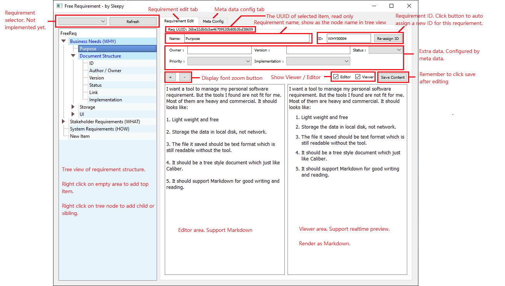
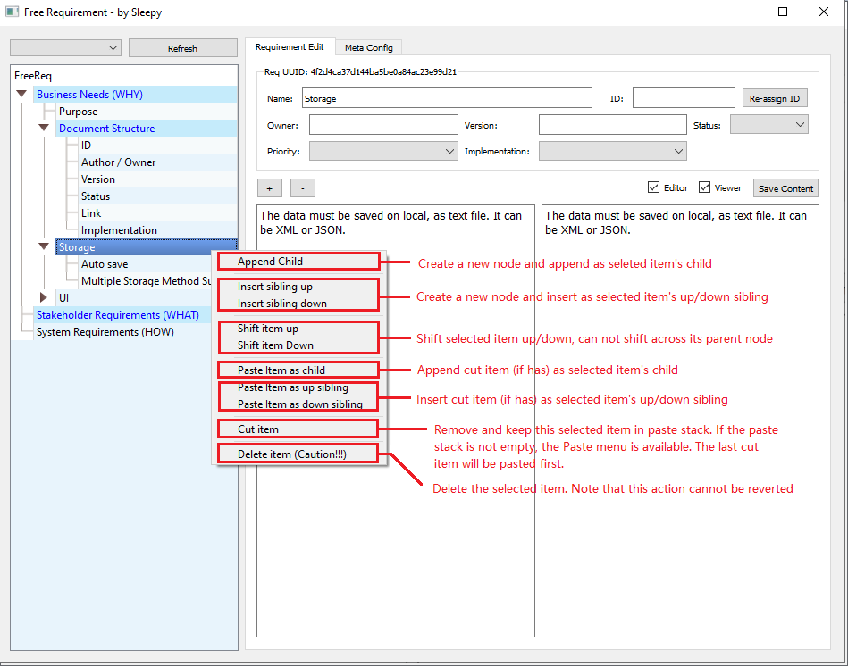

[CN](README.md)

# FreeReq

A free open source requirements management tool.

I need a tool to manage my open source project requirements, but I can't find a suitable one. 
Most requirements management tools are paid and heavy. The tool I expect should be:

1. Free and lightweight

2. The requirements file must be stored locally not online

3. The saved requirements file must be a text file that can be read even without using a specific tool and good for git

4. Organize the requirements document in a tree structure

5. It should support Markdown editing

Since I couldn't find such a tool, I decided to write one myself.


# Introduce

FreeReq can organize requirement documents into a tree structure. A requirement document can contain sub-requirement documents.

A requirement document contains the following basic information:

+ UUID - document unique identifier

+ Req ID - document requirement ID (Unique)

+ Title - document title, as the node name of the tree

+ Content - document content, edited in Markdown format

+ Last Editor - the last editor, the program should automatically read the system user name

+ Last Updater Time - the last editing time, the program should automatically fill in the save time

In addition, users can also customize fields, which are collectively called Meta Data, and these data will become part of the requirement document.

For detailed requirement descriptions, please refer to the FreeReq.req file.


# How to run

You can download the packaged release exe and run it directly. The advantage is convenience, but the disadvantages are:

+ Large size

+ Markdown display effect is not good
> Because QtWebEngine will be lost after packaging into exe, resulting in poor HTML rendering effect

+ Does not support plug-in function

The recommended way is to run FreeReq.py directly with python,

+ You can use pip install -r requirements.txt to install all dependencies.

+ Or run "run.bat" directly to create a virtual environment and automatically install dependencies (recommended).
> If it does not work properly, delete the "env" folder and re-run "run.bat"


# Plugins

FreeReq supports plugin extensions. You can rename "doc/config_example.json" to "config.json" and 
put it in the FreeReq root directory. Edit it to enable more plugins.

The currently implemented plugins are as follows:


## ScratchPaper

Sometimes we need to copy and paste some fixed-format text, and this plug-in is used to cache commonly used text.

When the plug-in is enabled, a "ScratchPaper" button will be added to the interface. Click this button to open the scratch paper window.

You can add preset text to the scratch paper, and the content will be automatically saved and loaded automatically the next time you run FreeReq.


## MarkdownStyle

It will add a combobox to select the Markdown render style (actually the HTML css style).

You can put more styles in plugin/MarkdownStyle folder.


## ReqHistory

This plugin will back up the requirement file before saving to the backup directory every time you save, and keep the latest 30 history files.

This plugin has no operation entry, and it will take effect in the background as long as it is enabled.

## MarkdownStyle

This plugin allows users to freely choose the style of Markdown rendering.

When the plugin is enabled, a selection box will be added to the interface, which will list all .css files in the "plugin/MarkdownStyle" directory.

When you select a style file, the Markdown preview window will be updated in real time to the style you selected.

You can also add your favorite CSS style file to the "plugin/MarkdownStyle" directory.

## ResourceManager

This plugin is used to easily clean up unreferenced files in the attachment directory, and check whether the images and attachment resources referenced in the document are valid.

This plugin lists existing resource files and files referenced in the document and checks their status:

+ OK - The file referenced in the document is valid

+ Invalid - The resource referenced in the document does not exist

+ No Reference - The resource file is not referenced by the document

This plugin also provides a one-click cleanup function, 
which will delete the files with the status of "No Reference" in the attachment directory.

## TestcaseLink

Select a folder, scan the files in it, and establish a mapping from Req ID to test case file.

When opening a Req file, if there is a ```Testcase``` directory under the directory, the plugin will automatically scan the directory. Otherwise, the user needs to manually specify the folder where the test case is located.

When the user selects a requirement item, a list of test cases corresponding to the requirement will be displayed according to the Req ID. Double-clicking an item in the list will open the corresponding test case file.

The indexer (scanner) is placed in ```plugin/TestcaseIndexer```. By default, a TestcaseFileNameScanner is implemented, which is suitable for the case where the Req ID is reflected in the test case file name.

If you need to obtain the Req ID referenced by the test case by scanning the file content, replace ```_extract_req_id_from_filename```.

## EmbeddingIndexing

Based on KeyFaiss, use embedding to index the requirements. With the help of vector database, 
users can search the requirements documents through natural language.

Please note that the embedding model affects the search results. In theory, according to different languages, 
you need to select the corresponding embedding model in the program (need to change the code).

This plugin requires the support of faiss and text2vec libraries.

## ChatReq - Chat with AI about requirements, the coolest feature

Based on the search results of the EmbeddingIndexing plugin, use LLM to talk to users.

In theory, with embedded search results and correct prompts. We can use any LLM to implement this function. The more powerful the LLM, the better the effect.

Now supports the following LLMs:

+ ChatGLM3

+ LLM web service similar to ChatGPT API

This plug-in provides web chat function based on gradio. Selecting different LLMs requires modifying the code.


# Update

## 20230711

+ Add CTRL+F to search whole tree and all content (F3 Find Next, SHIFT + F3 Find Previous)
+ The editor can accept file dropping.
+ The editor supports image and table pasting.
+ Use QWebEngineView for markdown preview (optional) which is better looking than QTextView.

## 20240117

+ Add build (pack) script.
+ Known issue: The pyinstaller pack missing QtWebEngine. So the web view is not available in exe.

## 20240227

+ Debug and update the ChatReq plugin using Chat-GLM2
+ Add print tree feature. Note that this feature depends on QWebEngineView
+ Add MarkdownStyle plugin.

## 20240305

+ Fix the cursor issue.

## 20240626

+ Add ReqHistory plugin
+ Add ResourceManager plugin
+ Add requirement file change watch
+ Add Req ID batch assign
+ Improve the ChatReq : Add ChatLLM.py and WebChat.py

## 20240902

+ Change the UI framework to QMainWidget and add menus
+ You can create a new Req file directly through the menu, including creating a new Req file according to the template
+ Optimize the method of opening links in Markdown. When using QWebEngineView, you can directly call the system command to open the file in the link

## 20240909

+ Add Meta Data statistics table function
+ Add expand/collapse tree node function

## 20240912

+ Added TestLink function and added TestcaseIndexer based on file name. If you need to analyze the content to find the Req ID of a testcase, you can modify the Indexer according to the prompt.
+ In order to implement the TestLink function, Hookable is added and the observer notification mechanism is improved.

# Usage





